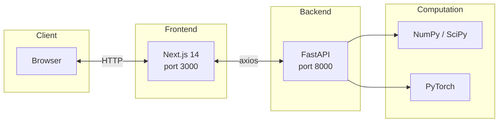
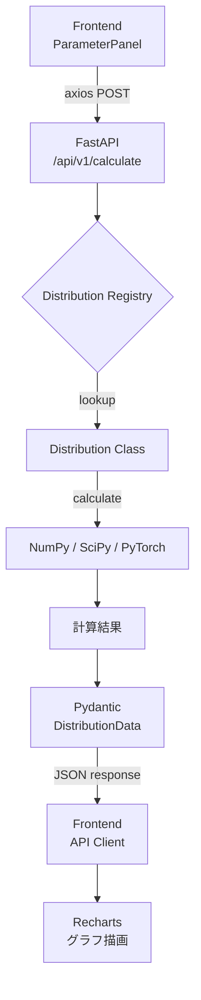

# アーキテクチャ設計書

## システム概要

本プロジェクトは、確率分布や機械学習モデルをインタラクティブに可視化するWebアプリケーションである。フロントエンドで数式表示・パラメータ操作・グラフ描画を行い、バックエンドで数値計算を実行する。

### システム構成図



## 技術スタック

### Frontend

| カテゴリ       | 技術          | バージョン | 用途                                |
| -------------- | ------------- | ---------- | ----------------------------------- |
| フレームワーク | Next.js       | 14         | App Router によるページルーティング |
| UIライブラリ   | React         | 18         | コンポーネントベースUI              |
| 言語           | TypeScript    | -          | 型安全なフロントエンド開発          |
| スタイリング   | Tailwind CSS  | -          | ユーティリティファーストCSS         |
| グラフ描画     | Recharts      | -          | 確率分布・回帰モデルの可視化        |
| 数式表示       | KaTeX         | -          | LaTeX数式のレンダリング             |
| アニメーション | framer-motion | -          | UIトランジション                    |
| 通知           | sonner        | -          | Toast通知                           |
| UIプリミティブ | Radix UI      | -          | アクセシブルなUIコンポーネント      |

### Backend

| カテゴリ       | 技術     | バージョン | 用途                        |
| -------------- | -------- | ---------- | --------------------------- |
| フレームワーク | FastAPI  | -          | REST API                    |
| 言語           | Python   | 3.11       | バックエンド実装            |
| 数値計算       | NumPy    | -          | 配列演算・確率分布計算      |
| 科学計算       | SciPy    | -          | 統計関数                    |
| 深層学習       | PyTorch  | -          | 勾配降下法による線形回帰    |
| バリデーション | Pydantic | -          | リクエスト/レスポンスモデル |

## ディレクトリ構成

```
├── frontend/           # Next.js 14 App Router
│   ├── app/           # ページコンポーネント
│   │   ├── page.tsx   # ホームページ（分布一覧）
│   │   ├── [dist]/page.tsx  # 分布詳細ページ
│   │   └── layout.tsx
│   ├── components/    # 再利用可能コンポーネント
│   ├── lib/           # API通信、定数
│   └── types/         # TypeScript型定義
├── backend/           # FastAPI
│   ├── api/routes.py  # APIルーティング
│   ├── models/
│   │   ├── distributions/  # 確率分布モデル
│   │   │   ├── base.py     # 基底クラス + Pydanticモデル
│   │   │   ├── uniform.py
│   │   │   └── exponential.py
│   │   ├── machine_learning_models/
│   │   │   └── linear_regression/
│   │   │       ├── model.py  # LinearRegression (3手法)
│   │   │       └── main.py   # API連携
│   │   └── evaluation_indicators/
│   │       └── metrics.py
│   ├── config.py
│   └── main.py
├── docs/
└── .github/workflows/ci.yml
```

## データフロー



### フロー詳細

1. **Frontend** - ユーザーがパラメータスライダーを操作すると、debounce後に `axios` で FastAPI へリクエストを送信する
2. **FastAPI** - `CalculateRequest` を Pydantic でバリデーションし、`Distribution Registry` から対応するクラスを取得する
3. **Distribution Registry** - `DistributionType` enum をキーとして、各分布クラスへのマッピングを保持する
4. **calculate()** - 各分布クラスの `calculate()` メソッドが NumPy/SciPy を用いて PDF、CDF、統計量を計算する
5. **DistributionData** - 計算結果を Pydantic モデルで構造化し、JSON としてフロントエンドに返却する
6. **Recharts** - 受け取ったデータ配列をグラフコンポーネントに渡し、チャートを再描画する
