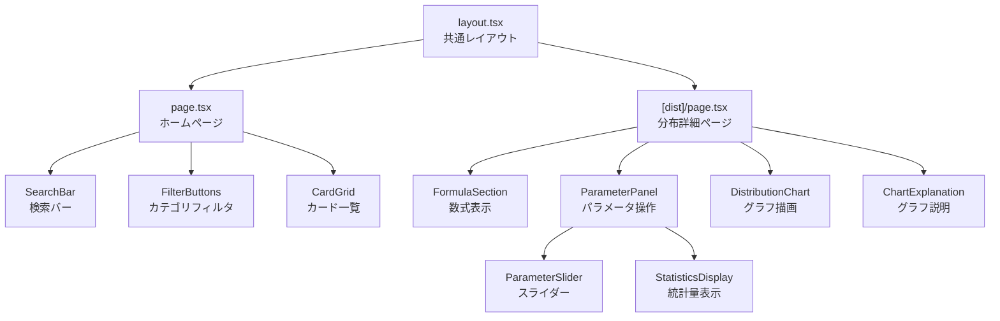

# 詳細設計書

## Backend API 仕様

### エンドポイント一覧

| メソッド | パス | リクエスト | レスポンス | 説明 |
|---|---|---|---|---|
| GET | `/api/v1/distributions` | - | `List[DistributionInfo]` | 全分布・モデルの一覧取得 |
| GET | `/api/v1/distributions/{dist_type}` | path: `dist_type` | `DistributionInfo` | 特定の分布情報取得 |
| POST | `/api/v1/calculate` | body: `CalculateRequest` | `DistributionData` | 分布・モデルの計算実行 |
| GET | `/api/v1/health` | - | `{"status": "healthy"}` | ヘルスチェック |

### GET /api/v1/distributions

全登録済み分布・モデルの情報を返す。

**レスポンス例:**

```json
[
  {
    "type": "uniform",
    "name": "一様分布",
    "category": "distribution",
    "description": "...",
    "parameters": [
      {
        "name": "a",
        "label": "下限 (a)",
        "min": -10,
        "max": 10,
        "step": 0.1,
        "default": 0
      }
    ]
  }
]
```

### GET /api/v1/distributions/{dist_type}

指定された `dist_type` に対応する分布情報を返す。存在しない場合は `404` を返す。

### POST /api/v1/calculate

パラメータに基づいて分布・モデルの計算を実行する。

**リクエスト例:**

```json
{
  "distribution_type": "uniform",
  "parameters": {
    "a": 0,
    "b": 1
  },
  "num_points": 200
}
```

**レスポンス例:**

```json
{
  "x": [0.0, 0.005, ...],
  "y": [1.0, 1.0, ...],
  "statistics": {
    "mean": 0.5,
    "variance": 0.0833,
    "std": 0.2887
  }
}
```

**エラーレスポンス (400):**

```json
{
  "detail": "Invalid parameters: a must be less than b"
}
```

### GET /api/v1/health

サーバーの稼働状態を確認する。

```json
{
  "status": "healthy"
}
```

---

## Pydantic モデル定義

### Enum

```python
class DistributionType(str, Enum):
    uniform = "uniform"
    exponential = "exponential"
    linear_regression = "linear_regression"

class CategoryType(str, Enum):
    distribution = "distribution"
    machine_learning = "machine_learning"
```

### DistributionParameter

パラメータスライダーの定義に使用する。

```python
class DistributionParameter(BaseModel):
    name: str                # パラメータ識別子 (e.g., "a", "b", "lambda")
    label: str               # 表示ラベル (e.g., "下限 (a)")
    min: float               # スライダー最小値
    max: float               # スライダー最大値
    step: float              # スライダーステップ
    default: float           # デフォルト値
```

### DistributionInfo

分布・モデルのメタ情報を格納する。

```python
class DistributionInfo(BaseModel):
    type: DistributionType
    name: str                          # 表示名 (e.g., "一様分布")
    category: CategoryType
    description: str                   # 説明文
    parameters: List[DistributionParameter]
```

### DistributionData

計算結果を格納する。

```python
class DistributionData(BaseModel):
    x: List[float]                     # x軸データ
    y: List[float]                     # y軸データ (PDF/予測値)
    statistics: Dict[str, float]       # 統計量 (mean, variance, std 等)
    cdf: Optional[List[float]]         # CDF (確率分布の場合)
    additional_data: Optional[Dict]    # 追加データ (回帰の散布図データ等)
```

### CalculateRequest

計算リクエストのバリデーションモデル。

```python
class CalculateRequest(BaseModel):
    distribution_type: DistributionType
    parameters: Dict[str, float]
    num_points: int = 200              # デフォルト200点
```

---

## Distribution Registry パターン

`DISTRIBUTION_REGISTRY` は `DistributionType` をキーとして各分布クラスへのマッピングを保持する辞書である。

```python
DISTRIBUTION_REGISTRY: Dict[DistributionType, Type[BaseDistribution]] = {
    DistributionType.uniform: UniformDistribution,
    DistributionType.exponential: ExponentialDistribution,
    DistributionType.linear_regression: LinearRegressionModel,
}
```

各クラスは以下のインターフェースを実装する:

```python
class BaseDistribution:
    @staticmethod
    def get_info() -> DistributionInfo:
        """分布のメタ情報を返す"""
        ...

    @staticmethod
    def calculate(params: Dict[str, float], num_points: int) -> DistributionData:
        """パラメータに基づいて計算を実行し結果を返す"""
        ...
```

新しい分布を追加する場合は、このインターフェースを実装し `DISTRIBUTION_REGISTRY` に登録するだけでよい。

---

## LinearRegression: 3つの手法

`LinearRegression` クラスは、同一の線形回帰問題に対して3つの異なる手法を提供する。

### 1. Analytical (解析解)

最小二乗法の公式を直接適用する。

```
slope = Σ(xi - x̄)(yi - ȳ) / Σ(xi - x̄)²
intercept = ȳ - slope * x̄
```

- 計算コスト: O(n)
- 数値安定性: 高い（単純回帰の場合）

### 2. Matrix (正規方程式)

行列演算による解法。

```
β = (XᵀX)⁻¹Xᵀy
```

- NumPy の `np.linalg.lstsq` を使用
- 計算コスト: O(n)（単純回帰の場合）
- 多変量回帰への拡張が容易

### 3. Gradient Descent (勾配降下法)

PyTorch を用いた反復最適化。

```
θ := θ - α * ∂L/∂θ
```

- PyTorch の自動微分を活用
- 学習率・エポック数をパラメータとして指定可能
- 学習過程の可視化に適している

---

## Frontend コンポーネントツリー



### 各コンポーネントの責務

| コンポーネント | 責務 |
|---|---|
| `layout.tsx` | 共通ヘッダー・フッター、グローバルスタイル適用 |
| `page.tsx` (ホーム) | 分布一覧のカードグリッド表示、検索・フィルタ機能 |
| `[dist]/page.tsx` | 個別分布の詳細ページ、API通信、状態管理 |
| `FormulaSection` | KaTeX を用いたLaTeX数式のレンダリング |
| `ParameterPanel` | パラメータスライダー群と統計量表示を束ねるコンテナ |
| `ParameterSlider` | 個別パラメータのスライダーUI |
| `StatisticsDisplay` | 平均・分散・標準偏差等の統計量表示 |
| `DistributionChart` | Recharts による PDF/CDF グラフ描画 |
| `ChartExplanation` | グラフの読み方・パラメータの影響の解説 |

---

## 定数管理: LaTeX数式

`lib/constants/formulas.ts` に各分布のLaTeX数式を一元管理する。

```typescript
// lib/constants/formulas.ts
export const DISTRIBUTION_FORMULAS: Record<DistributionType, FormulaSet> = {
  uniform: {
    pdf: "f(x) = \\begin{cases} \\frac{1}{b-a} & a \\leq x \\leq b \\\\ 0 & \\text{otherwise} \\end{cases}",
    cdf: "F(x) = \\frac{x - a}{b - a}",
    mean: "E[X] = \\frac{a + b}{2}",
    variance: "Var(X) = \\frac{(b - a)^2}{12}",
  },
  exponential: {
    pdf: "f(x) = \\lambda e^{-\\lambda x}",
    cdf: "F(x) = 1 - e^{-\\lambda x}",
    mean: "E[X] = \\frac{1}{\\lambda}",
    variance: "Var(X) = \\frac{1}{\\lambda^2}",
  },
  // ...
};
```

この設計により、数式の追加・修正はフロントエンドの定数ファイルのみで完結する。
