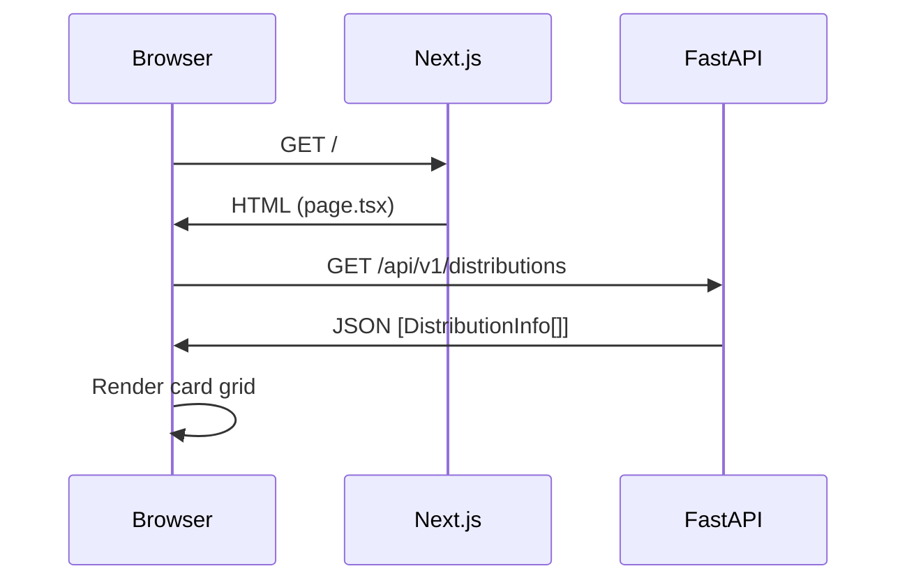
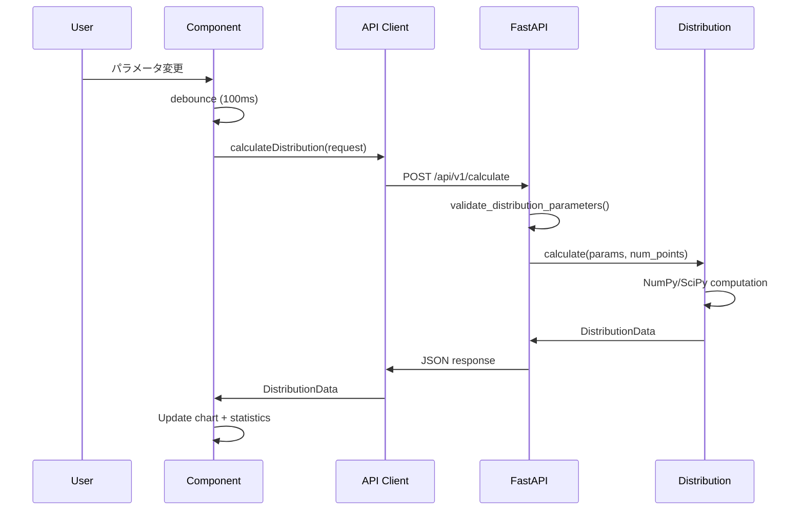
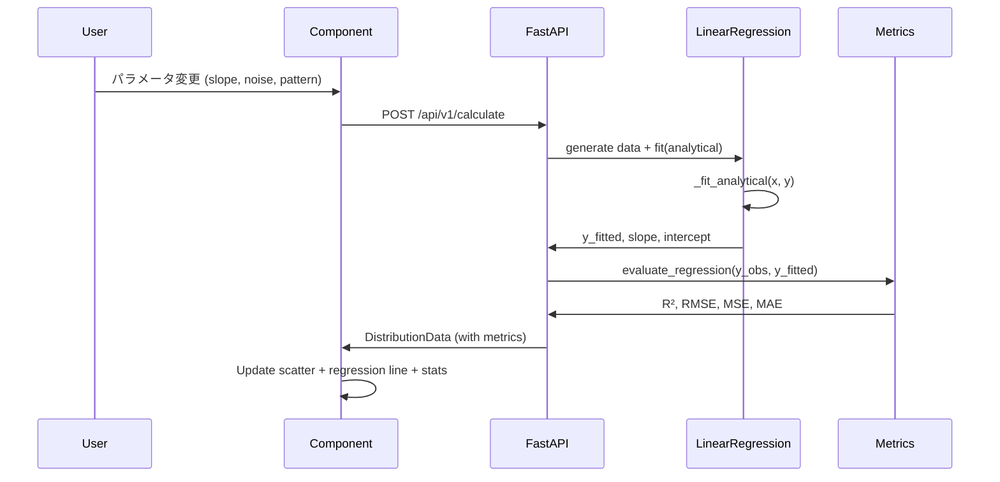
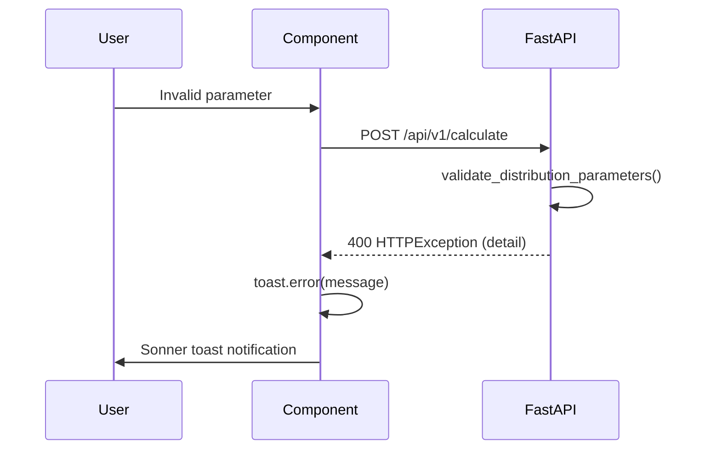

# シーケンス図

本ドキュメントでは、主要なユースケースのシーケンス図を Mermaid 形式で記載する。

---

## 1. ホームページ表示フロー

ユーザーがホームページにアクセスした際、分布一覧をカードグリッドとして表示するまでの流れ。

### 処理詳細

1. ブラウザが Next.js サーバーにページリクエストを送信する
2. Next.js が `page.tsx` をレンダリングし、HTMLを返す
3. クライアントサイドで `useEffect` により FastAPI の一覧取得APIを呼び出す
4. 取得した `DistributionInfo[]` をもとにカードグリッドを描画する
5. 検索バーとフィルタボタンによりクライアントサイドで絞り込みが可能

---

## 2. 確率分布計算フロー

ユーザーがパラメータスライダーを操作し、確率分布のグラフが更新されるまでの流れ。

### 処理詳細

1. ユーザーがスライダーを操作すると、`onChange` イベントが発火する
2. debounce (100ms) により高頻度リクエストを抑制する
3. API Client が `CalculateRequest` を構築し、FastAPI に POST する
4. FastAPI はパラメータのバリデーションを行い、不正な場合は `400 HTTPException` を返す
5. バリデーション通過後、`DISTRIBUTION_REGISTRY` から対応する分布クラスを取得する
6. 分布クラスの `calculate()` が NumPy/SciPy を用いて PDF、CDF、統計量を計算する
7. 計算結果を `DistributionData` として JSON シリアライズし返却する
8. フロントエンドが Recharts のデータを更新し、グラフと統計量表示を再描画する

---

## 3. 機械学習モデル計算フロー

線形回帰モデルにおいて、ユーザーがパラメータを変更し、散布図・回帰直線・評価指標が更新されるまでの流れ。

### 処理詳細

1. ユーザーが傾き (slope)、ノイズ (noise)、データパターン (pattern) を変更する
2. フロントエンドが `distribution_type: "linear_regression"` として計算リクエストを送信する
3. FastAPI が `LinearRegression` クラスにデータ生成とフィッティングを委譲する
4. `_fit_analytical()` により解析解で回帰係数を算出する（matrix, gradient_descent も選択可能）
5. フィッティング結果を `evaluate_regression()` に渡し、評価指標を計算する
   - **R² (決定係数)**: モデルの説明力
   - **RMSE (二乗平均平方根誤差)**: 予測誤差の標準的な大きさ
   - **MSE (平均二乗誤差)**: 予測誤差の二乗平均
   - **MAE (平均絶対誤差)**: 予測誤差の絶対値平均
6. 散布図データ、回帰直線データ、評価指標を `DistributionData` に格納して返却する
7. フロントエンドが散布図、回帰直線、統計量パネルを更新する

---

## 4. エラーハンドリングフロー

不正なパラメータが送信された場合のエラー処理フロー。

### 処理詳細

1. ユーザーが不正なパラメータを入力する（例: 一様分布で `a >= b`）
2. フロントエンドはクライアントサイドバリデーションを通過した場合、APIにリクエストを送信する
3. FastAPI の `validate_distribution_parameters()` がパラメータの整合性を検証する
4. バリデーションエラーの場合、`HTTPException(status_code=400, detail="...")` を送出する
5. フロントエンドの API Client が `AxiosError` をキャッチし、エラーメッセージを抽出する
6. `sonner` の `toast.error()` により画面上部に通知を表示する
7. チャートと統計量は前回の正常値を維持する（エラー時にデータをクリアしない）

### 主なバリデーションルール

| 分布 | パラメータ制約 | エラーメッセージ |
|---|---|---|
| 一様分布 | `a < b` | "Invalid parameters: a must be less than b" |
| 指数分布 | `lambda > 0` | "Invalid parameters: lambda must be positive" |
| 線形回帰 | `num_points > 0` | "Invalid parameters: num_points must be positive" |
